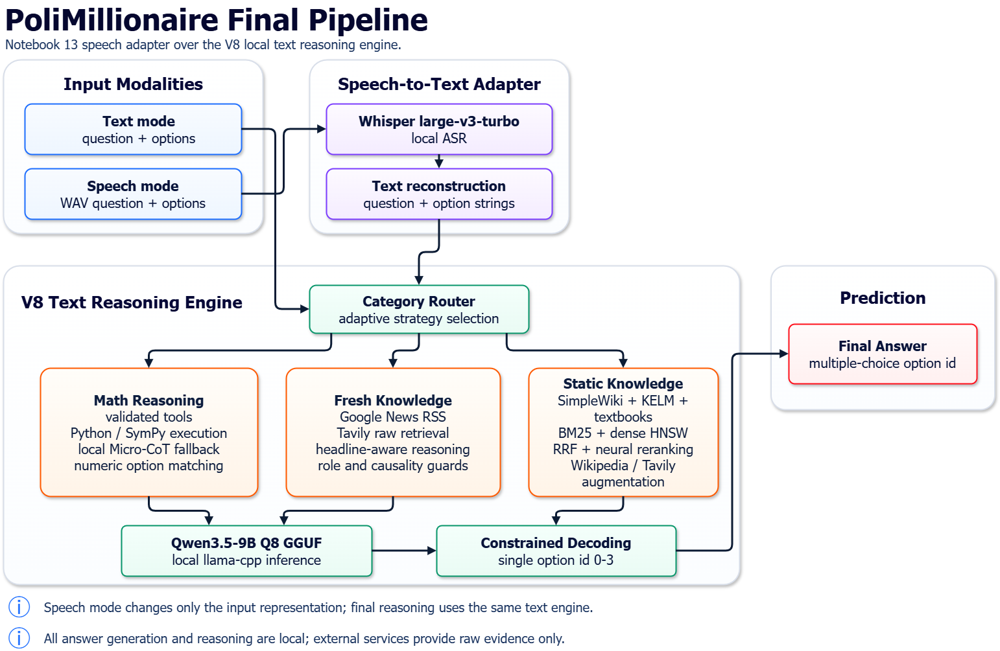

# 🍹 PoliMillionaire NLP 2026

> **Who Wants to Be a PoliMillionaire?** — un agente RAG che gioca al quiz usando solo modelli open-weights eseguiti in locale.

<div align="center">

### 👥 Team **NeuroniNegroni**

| Membro | GitHub |
| :-- | :-- |
| **Giulia Mengoli** | [@giulimengo](https://github.com/giulimengo) |
| **Giorgio Monaco** | [@giorgiomonaco](https://github.com/giorgiomonaco) |
| **Tommaso Neri** | [@tommasonerii](https://github.com/tommasonerii) |

*Progetto del corso di Natural Language Processing — A.A. 2025/26 @ Politecnico di Milano*

</div>

---

Il sistema gioca a **Who Wants to Be a PoliMillionaire?** usando modelli open-weights eseguiti localmente. La soluzione finale combina retrieval augmented generation, reranking neurale, tool deterministici per matematica, fonti esterne non generative per domande recenti e una variante speech con ASR locale.

## Versione finale

Il notebook principale finale da consegnare e presentare è:

```text
project/notebooks/delivery/notebook_final.ipynb
```

Questo notebook include la pipeline testuale finale e la sua estensione speech. La base testuale, utile come riferimento e ablation, è:

```text
project/notebooks/development/12-v8-clean.ipynb
```

`notebook_final.ipynb` parte dalla pipeline di `12-v8-clean.ipynb` e aggiunge solo l'adapter speech: scarica gli audio WAV dal server, trascrive domanda e opzioni con Whisper, costruisce una domanda testuale compatibile e richiama la stessa `answer_strategy`.

I notebook `00-12_V7` restano come baseline, ablation e storia sperimentale.

## Vincoli dell'assignment

- Nessuna API LLM esterna per generare risposte.
- Solo modelli open-weights eseguiti localmente.
- RAG ammesso e incoraggiato.
- API esterne ammesse solo se restituiscono contenuto grezzo, non risposte generate.
- Tool agentici e calcolo simbolico ammessi.
- Timeout di circa 30 secondi per domanda.
- Evitare richieste troppo ravvicinate al server.
- Confrontare piu soluzioni, modelli, prompt e architetture.

La consegna ufficiale è in [docs/assignment/GroupAssignment2026.docx](docs/assignment/GroupAssignment2026.docx).

## Stack finale

| Componente | Scelta finale |
| --- | --- |
| Notebook principale | `project/notebooks/delivery/notebook_final.ipynb` |
| Base testuale | `project/notebooks/development/12-v8-clean.ipynb` |
| LLM answer/reasoning | `Qwen_Qwen3.5-9B-Q8_0.gguf` via `llama-cpp-python` |
| GGUF repo | `bartowski/Qwen_Qwen3.5-9B-GGUF` |
| Reranker | `Qwen/Qwen3-Reranker-0.6B` |
| Embedding dense | `sentence-transformers/multi-qa-MiniLM-L6-cos-v1` |
| Sparse retrieval | BM25/BM25S |
| Dense retrieval | HNSW |
| Corpora locali | SimpleWiki, KELM, textbook matematici |
| Fonti esterne | Wikipedia API, Google News RSS, Tavily |
| Maths | tool validati, SymPy/Python executor, Micro-CoT fallback |
| Speech ASR | `openai/whisper-large-v3-turbo` |
| Output vincolato | GBNF single digit `0-3`, parser `FINAL_CHOICE`, matching opzioni |

## Risultati osservati

I log nel repository nella modalità text, mostrano almeno una run a **$1,024,000** per ogni categoria. Il miglioramento piu importante del è su **Maths**, dove `logs/run_v8.csv` arriva a $1,024,000 con 98 righe, 79 corrette, accuracy 80.6%, latenza media 12.27s e 0 timeout.

| Categoria | Best earning osservato | Log di riferimento |
| --- | ---: | --- |
| Entertainment | $1,024,000 | `logs/run_qwen35_gguf_all_competitions.csv`, `logs/run_v5.csv` |
| Ancient History and Politics | $1,024,000 | `logs/run_qwen35_gguf_agentic_tools_v3_all_competitions.csv`, `logs/run_qwen35_gguf_validated_tools_option_retrieval_v2.csv` |
| Science and Nature | $1,024,000 | diversi log RAG/GGUF |
| Philosophy and Psychology | $1,024,000 | `logs/run_qwen35_q8_qwen3reranker06b_external_bm25s_v6.csv` |
| News | $1,024,000 | `logs/run_qwen35_gguf_validated_tools_option_retrieval_v4.csv` |
| Maths | $1,024,000 | `logs/run_12_V3_math_1M.csv`, `logs/run_v8.csv` |

La modalita speech è funzionante ma piu sperimentale: `logs/run_v9_speech.csv` mostra che il collo di bottiglia è ASR + timeout server, non la pipeline testuale sottostante. Il notebook salva anche gli audio in `speech_audio_v9/` per analisi degli errori di trascrizione.

## Quick Start finale

### Kaggle

I notebook finali sono pensati per Kaggle con due GPU T4 e due dataset di input:

```text
/kaggle/input/datasets/giorgiomonacoo/nlp2026
/kaggle/input/datasets/tommasonerii/indexes-nlp26
```

Configurare i secrets Kaggle:

```text
USERNAME
PASSWORD
HF_TOKEN
TAVILY-API-KEY
```

Per la consegna finale, eseguire `project/notebooks/delivery/notebook_final.ipynb` dall'inizio. Il notebook:

1. installa dipendenze minime;
2. rileva ambiente Kaggle/Colab/local;
3. copia gli indici in working storage;
4. scarica e valida il GGUF Qwen3.5 Q8;
5. carica embedding model, BM25/HNSW e reranker Qwen3;
6. carica tool Maths, retrieval esterno e routing policy;
7. esegue le celle per categoria e appende i risultati testuali nei logs;
8. nelle celle speech finali, carica Whisper e salva risultati speech.

### Colab o locale

Il progetto supporta anche Colab/local, ma Kaggle e l'ambiente piu stabile per la consegna finale perche separa chiaramente dataset read-only e output in `/kaggle/working`.

Se si usa Colab, copiare su Drive:

```text
MyDrive/nlp26/
|-- project/notebooks/delivery/notebook_final.ipynb
|-- project/notebooks/development/12-v8-clean.ipynb
|-- api_client/NLP_assignment_api_client/
|-- project/src/
|-- data/indexes/
`-- data/chunks/ o corpus necessari
```

Usare Colab/Kaggle secrets, non credenziali hardcoded.

## Architettura finale

Diagramma riassuntivo:



```text
Question + options
    |
    v
Environment setup
    |-- API client
    |-- local indexes
    |-- Qwen3.5 GGUF
    |-- Qwen3 reranker
    |
    v
Routing policy
    |
    |-- Maths
    |     |-- validated deterministic tools
    |     |-- Python/SymPy executor fallback
    |     `-- Micro-CoT local Qwen fallback with FINAL_CHOICE
    |
    |-- News
    |     |-- Google News RSS US/UK
    |     |-- Tavily news/raw search
    |     |-- headline-aware prompt
    |     |-- model-knowledge fallback if articles lack answer
    |     `-- constrained RAG fallback
    |
    |-- Entertainment / History
    |     |-- local retrieval
    |     |-- Wikipedia API
    |     |-- Tavily raw retrieval
    |     `-- unified rerank + answer extraction
    |
    `-- Default knowledge categories
          |-- SimpleWiki BM25 + dense HNSW
          |-- KELM BM25 + dense HNSW
          |-- optional textbook indexes
          |-- RRF fusion
          |-- Qwen3 reranking
          `-- adaptive option-wise evidence
    |
    v
Constrained option id
    |
    v
API answer + CSV logging
```

### Speech adapter

L'adapter speech (integrato in `notebook_final.ipynb`, sviluppato in `development/13_speech.ipynb`) mantiene invariata la pipeline testuale:

```text
Speech game WAV audio
    |
    v
Whisper large-v3-turbo
    |
    v
SpeechQuestion(question_text, option_texts)
    |
    v
V8 answer_strategy
    |
    v
API answer + speech metadata logging
```

Il log speech aggiunge transcript, path audio, tempi di fetch, tempi ASR e device ASR.

## Componenti principali

### Retrieval locale

- SimpleWiki: conoscenza enciclopedica breve.
- KELM: asserzioni strutturate utili per domande fattive.
- Textbook matematici: statistica, algebra, calcolo, discreta, analisi, topologia.
- BM25 per recall lessicale rapido.
- HNSW dense search per similarita semantica.
- Reciprocal Rank Fusion per unire ranking sparse/dense.
- Qwen3-Reranker per riordinare i candidati finali.

### Retrieval esterno

Le fonti esterne non generano risposte: restituiscono testo grezzo che viene poi valutato localmente.

- Wikipedia API: usata soprattutto per Entertainment e Ancient History/Politics.
- Google News RSS: usata per News, con decodifica degli URL e fetch del corpo articolo.
- Tavily: usato come seconda fonte raw per aumentare copertura su News e knowledge.

### Maths

Il ramo Maths evita di dipendere subito dal modello:

1. pattern e tool deterministici validati;
2. matching numerico/testuale verso le opzioni;
3. Python executor sandbox con SymPy/math/Fraction/NormalDist;
4. Micro-CoT Qwen locale con output vincolato.

Il router JSON LLM rimane nel codice come baseline/ablation, ma nel routing i tool deterministici sono privilegiati per latenza e robustezza.

### Output e parsing

- Quando supportato da `llama-cpp-python`, il notebook usa GBNF `root ::= [0-3]` per forzare un singolo option id.
- I fallback Maths usano `FINAL_CHOICE`.
- Il parser prova anche match testuale e numerico con le opzioni.
- Il CSV logga raw output, strategia, confidenza, fallback, tool trace e contesto recuperato.

## Modelli ed evoluzione

### Modelli usati

| Modello / tecnica | Uso nel progetto | Punti deboli osservati |
| --- | --- | --- |
| First-option baseline | Baseline minima: sceglie sempre la prima opzione e verifica API/logging end-to-end. | Accuracy casuale, nessuna comprensione, utile solo per testare il client e i CSV. |
| TF-IDF | Primo retrieval lessicale su SimpleWiki/KELM. | Molto sensibile alle parole esatte; fallisce su parafrasi, domande recenti e opzioni semanticamente vicine. |
| BM25 | Retrieval sparse piu robusto di TF-IDF, usato su SimpleWiki, KELM e textbook. | Ancora lessicale: premia overlap superficiale e puo recuperare documenti fuori contesto. |
| BM25S | Variante veloce per indicizzare al volo documenti esterni o corpus piccoli. | Dipende dalla qualita dei documenti recuperati; se la fonte esterna e rumorosa, indicizza rumore. |
| `cross-encoder/ms-marco-MiniLM-L6-v2` | Primo reranker neurale nei notebook 05-06. | Economico ma non abbastanza forte per domande complesse e contesti lunghi. |
| `sentence-transformers/multi-qa-MiniLM-L6-cos-v1` | Embedding dense per HNSW e retrieval semantico. | Migliora recall semantico, ma da solo non decide la risposta e puo recuperare passaggi semanticamente vicini ma non risolutivi. |
| HNSW | Indice approximate nearest neighbor per ricerca dense veloce. | Richiede indici precomputati e metadati coerenti; la qualita dipende dagli embedding. |
| `Qwen/Qwen2.5-0.5B/1.5B-Instruct` | Esperimenti iniziali con LLM piccolo e tool-router in Colab. | Troppo debole per reasoning affidabile e output strutturato sotto timeout. |
| `Qwen_Qwen3.5-9B-Q6_K_L.gguf` | Primo LLM locale forte per RAG e Maths. | Buon compromesso memoria/velocita, ma meno accurato del Q8 e piu fragile su calcoli o output vincolati. |
| `Qwen_Qwen3.5-9B-Q8_0.gguf` | LLM finale per reasoning, scelta opzione e fallback. | Piu pesante in VRAM/disk; richiede setup llama.cpp corretto e puo comunque sbagliare se il retrieval e rumoroso. |
| `Qwen/Qwen3-Reranker-0.6B` | Reranker finale per candidati locali e fonti esterne. | Costoso rispetto a MiniLM; su singola T4 compete con il GGUF per GPU/latency. |
| SymPy / Python executor | Calcolo deterministico per Maths: equazioni, probabilita, algebra, statistica. | Serve parsing robusto della domanda; fallisce se il testo e ambiguo o se il problema richiede concetti non codificati. |
| Wikipedia API | Fonte esterna grezza per Entertainment e History. | Omonimie e pagine correlate possono distrarre; serve query generation e reranking conservativo. |
| Google News RSS | Fonte primaria per News recenti. | Articoli non sempre accessibili, titoli piu informativi del corpo, redirect e contenuto HTML rumoroso. |
| Tavily | Fonte raw alternativa per News e knowledge. | Copertura utile ma non garantita; puo restituire risultati correlati invece della notizia esatta. |
| `openai/whisper-large-v3-turbo` | ASR finale per modalita speech. | Aggiunge latenza e puo trascrivere male matematica, nomi propri e opzioni brevi. |

### Evoluzione sperimentale

| Step | Cosa cambia | Perche serviva | Limite che ha portato allo step successivo |
| --- | --- | --- | --- |
| `00` | Smoke test API e first-option logging. | Verificare login, start game, answer submit e CSV. | Non risolve il task, serve solo come baseline. |
| `01-04` | TF-IDF/BM25 su SimpleWiki e KELM, senza LLM. | Capire quanto basta il retrieval lessicale. | Recupera evidenza ma non ragiona bene sulle opzioni; scarsa robustezza semantica. |
| `05` | Aggiunta reranker MiniLM/BERT. | Riordinare i documenti recuperati da BM25. | Migliora il ranking, ma senza LLM manca una vera decisione contestuale. |
| `06` | Primo LLM piccolo Qwen + tool-router Maths. | Far scegliere l'opzione al modello e provare tool strutturati. | Modello piccolo instabile; JSON/tool call fragili. |
| `07` | Costruzione indici dense HNSW. | Aumentare recall semantico oltre l'overlap lessicale. | Dense retrieval aiuta ma va fuso e rerankato. |
| `08` | Hybrid RAG con Qwen3.5-9B GGUF. | Passaggio a LLM locale forte con BM25+dense+RRF. | Maths e output parsing restano fragili. |
| `09-11` | Tool Maths, router JSON e hardening. | Coprire calcoli ricorrenti con SymPy/tool invece che solo LLM. | Router troppo permissivo o costoso; molti edge case matematici non coperti. |
| `12` / `12_V2` | Validated tools, option-wise retrieval, GBNF. | Rendere output e tool call piu controllabili. | News e domande recenti non coperte dal corpus statico; Maths ancora incompleto. |
| `12_V3` / `12_V4` | Analysis-first Maths, Micro-CoT, News/Tavily. | Dare al modello un minimo spazio di ragionamento e aggiungere fonti recenti. | Fonti esterne rumorose e mapping News fragile. |
| `12_V5*` | Unified retrieval e answer-first micro-reasoning. | Evitare troncamenti: risposta prima, ragione dopo. | Ottimo su knowledge, ma Maths ancora richiede tool piu mirati. |
| `12_V6` / `12_V7` | Qwen3-Reranker, external retrieval piu controllato, anti-trap News. | Migliorare fonti esterne e ridurre distrazioni. | La raccomandazione V7 e superata dal lavoro finale V8. |
| `12-v8-maths` | Esperimenti dedicati al ramo Maths. | Portare Maths a livello competitivo con fix e tool/fallback piu mirati. | Notebook sperimentale, non pulito come deliverable principale. |
| `12-v8-clean` | Consolidamento finale della pipeline testuale. | Riunire le parti migliori in un notebook piu lineare e usabile per consegna. | Non include speech; quello e separato in V13. |
| `13_speech` | Adapter speech sopra V8 con Whisper large-v3-turbo. | Supportare la modalita vocale senza cambiare il decision engine. | ASR e fetch audio consumano tempo; matematica parlata e opzioni brevi restano difficili. |

## Notebook map

I notebook sono organizzati in due cartelle:

- `project/notebooks/delivery/` — il notebook finale da consegnare e presentare;
- `project/notebooks/development/` — baseline, ablation e storia sperimentale.

### Delivery — `project/notebooks/delivery/`

| Notebook | Ruolo | Stato |
| --- | --- | --- |
| `notebook_final.ipynb` | pipeline testuale V8 + adapter speech | **finale principale** |
| `notebook_final_html.html` | export HTML del notebook finale | snapshot presentazione |

### Development — `project/notebooks/development/`

| Notebook | Ruolo | Stato |
| --- | --- | --- |
| `00_api_smoke_test.ipynb` | smoke test API e first-option baseline | baseline |
| `01_quiz_tfidf_no_llm.ipynb` | TF-IDF SimpleWiki senza LLM | baseline |
| `02_quiz_bm25_no_llm.ipynb` | BM25 SimpleWiki senza LLM | baseline |
| `03_quiz_bm25_multi_index_no_llm.ipynb` | BM25 SimpleWiki + KELM | baseline |
| `04_quiz_tfidf_multi_index_no_llm.ipynb` | TF-IDF SimpleWiki + KELM | baseline |
| `05_quiz_bm25_multi_index_bert_no_llm.ipynb` (+ `_colab`) | BM25 + MiniLM/BERT reranker | ablation reranking |
| `06_quiz_bm25_bert_llm_agentic_tools_colab.ipynb` | primo LLM piccolo + tool router | ablation agentica |
| `07_build_dense_embeddings_colab.ipynb` | costruzione indici dense HNSW | utility |
| `08_hybrid_pipeline.ipynb` | prima Hybrid RAG con Qwen3.5 GGUF | baseline LLM |
| `09_hybrid_pipeline_math_tools.ipynb` | aggiunta tool Maths e textbook indexes | ablation Maths |
| `10_agentic_math_tools_prof_style.ipynb` | router JSON Maths in stile tool-use | ablation |
| `11_agentic_math_router_hardened.ipynb` | hardening parser/router Maths | ablation |
| `12_validated_tools_option_retrieval.ipynb` | validated tools + option retrieval V1 | baseline forte |
| `12_V2_validated_tools_option_retrieval.ipynb` | GBNF + adaptive retrieval + fix Maths | ablation |
| `12_V3_validated_tools_option_retrieval.ipynb` | analysis router + Micro-CoT | ablation |
| `12_V3_math_1M.ipynb` | esperimento Maths dedicato da $1,024,000 | evidence |
| `12_V4_validated_tools_option_retrieval.ipynb` | News/Tavily + Maths esteso | ablation |
| `12_V5-kaggle.ipynb` | unified retrieval + answer-first reasoning | ablation Kaggle |
| `12_V5_complete.ipynb` | V5 + Qwen3 reranker + News fallback + Python executor | baseline pre-V8 |
| `12_V6_validated_tools_option_retrieval.ipynb` | external BM25S temporaneo + Qwen3 reranker | ablation external |
| `12_V7_validated_tools_option_retrieval.ipynb` | semantic gate + anti-trap News prompt | baseline precedente |
| `12-v8-maths.ipynb` | ramo sperimentale Maths/V8 | evidence |
| `12-v8-clean.ipynb` | pipeline testuale V8 pulita | base testuale finale |
| `13_final.ipynb` | consolidamento pipeline V8 + speech | pre-delivery |
| `13_final_comments.ipynb` | versione commentata end-to-end della pipeline finale | documentazione |
| `13_speech.ipynb` | pipeline V8 + speech adapter | sviluppo speech |
| `ASR_speech_benchmark.ipynb` | benchmark ASR live separato | analisi speech |

> Riferimento esterno: `api_client/NLP_assignment_api_client/PoliMillionaire.ipynb` è il tutorial API ufficiale.

## Struttura repository

```text
NLP_polimi_26/
|-- api_client/
|   `-- NLP_assignment_api_client/
|       `-- millionaire_client/       # client Python per API PoliMillionaire
|-- data/
|   |-- chunks/                       # corpus chunkati (jsonl) per gli indici
|   |-- indexes/                      # indici BM25 e dense HNSW, spesso via Git LFS
|   |-- kelm/                         # subset KELM
|   |-- maths/                        # PDF textbook per indici matematici
|   `-- wiki/                         # dump SimpleWiki
|-- docs/
|   |-- assignment/                   # consegna ufficiale
|   |-- slides/ , tutorials/          # materiale di corso e tutorial
|   |-- retrieval_indexes.md          # comandi per corpus e indici
|   `-- kelm_limited.md               # note subset KELM
|-- logs/                             # CSV e analisi esperimenti
|-- project/
|   |-- notebooks/
|   |   |-- delivery/                 # notebook finale da consegnare
|   |   `-- development/              # baseline, ablation, storia sperimentale
|   `-- src/                          # script corpus, indici, retrieval, tool
|-- reports/
|   `-- figures/                      # grafici generati (incl. Final_Pipeline_IMG.png)
|-- API_README.md
`-- README.md
```

## Setup repository

Gli indici e alcuni PDF sono file grandi e possono usare Git LFS:

```bash
git lfs install
git lfs pull
```

Ambiente locale minimo per script e analisi:

```bash
conda create -n polimillionaire python=3.11
conda activate polimillionaire
pip install numpy pandas scikit-learn joblib bm25s pypdf requests matplotlib seaborn sympy
```

I notebook finali installano autonomamente le dipendenze runtime piu pesanti, inclusi:

```text
huggingface_hub
hnswlib
bm25s
llama-cpp-python
sentence-transformers
transformers
accelerate
googlenewsdecoder
tavily-python
soundfile
scipy
```

## API PoliMillionaire

Endpoint assignment:

```text
http://131.175.15.22:51111/
```

Uso minimo:

```python
import sys
sys.path.append("api_client/NLP_assignment_api_client")

from millionaire_client import MillionaireClient

client = MillionaireClient("http://131.175.15.22:51111/")
client.login(username, password)
competitions = client.competitions.list_all()
```

Modalita speech:

```python
game = client.game.start(competition_id=comp_id, mode="speech")
question_audio = game.fetch_audio_question()
option_a_audio = game.fetch_audio_option_next()
```

Dettagli completi in [API_README.md](API_README.md).

## Costruire corpus e indici

La documentazione completa e in [docs/retrieval_indexes.md](docs/retrieval_indexes.md).

Esempio SimpleWiki chunks:

```bash
conda run -n polimillionaire python project/src/make_retrieval_corpus.py \
  data/wiki/simplewiki_articles.jsonl \
  --source simplewiki \
  --id-prefix swiki \
  --max-words 160 \
  --overlap-words 30 \
  --min-words 20 \
  --output data/chunks/simplewiki_160w.jsonl
```

Indice BM25:

```bash
conda run -n polimillionaire python project/src/build_retrieval_index.py \
  data/chunks/simplewiki_160w.jsonl \
  --kind bm25 \
  --title-repeat 2 \
  --bm25-remove-stopwords \
  --output data/indexes/simplewiki_160w_title2_stop_bm25.joblib
```

Indici matematici:

```powershell
.\project\src\build_all_textbook_bm25_indexes.ps1
.\project\src\build_all_textbook_dense_indexes.ps1
```

Query manuale:

```bash
conda run -n polimillionaire python project/src/query_retrieval_index.py \
  data/indexes/simplewiki_160w_title2_stop_bm25.joblib \
  --query "What term describes Buster Keaton's signature facial expression? Grin Laugh Deadpan Smirk" \
  --top-k 3
```

## Logging

Campi diagnostici rilevanti:

- `competition_name`, `question_id`, `question_level`
- `chosen_option_id`, `correct`, `earned_amount`, `timed_out`
- `latency_seconds`
- `strategy`, `decision_source`, `confidence`
- `raw_llm_output`, `prompt_version`
- `retrieved_context`, `retrieval_sources`, score e margini retrieval
- `option_evidence_scores_json`, `option_evidence_json`
- `tool_validated`, `validated_tool_call`, `math_tool_trace`
- `fallback_used`
- `textbook_context_*`
- speech-only: transcript, path audio, fetch seconds, ASR seconds, ASR model/device

## Troubleshooting

| Problema | Soluzione |
| --- | --- |
| `ModuleNotFoundError: millionaire_client` | Assicurarsi che `api_client/NLP_assignment_api_client` sia in `sys.path`. |
| API non raggiungibile | Evitare Wi-Fi PoliMi se blocca la porta; usare rete mobile/VPN. |
| Kaggle senza GPU | Abilitare accelerator GPU e verificare con `nvidia-smi`. |
| OOM su GGUF o reranker | Ridurre `RERANKER_BATCH_SIZE`, `RERANKER_MAX_LENGTH`, `LLM_CONTEXT_K` o GPU layers llama.cpp. |
| GGUF non valido | Verificare size/header `GGUF`; cancellare cache modello e riscaricare revision pinning. |
| `TAVILY-API-KEY` mancante | Creare il secret Kaggle con quel nome esatto o adattare la cella. |
| Output LLM non parsabile | Usare GBNF quando disponibile; altrimenti controllare `raw_llm_output` e fallback. |
| News rumorose | Controllare articoli, headline e `retrieval_sources`; Tavily/RSS possono recuperare articoli correlati ma non risolutivi. |
| Maths lento o sbagliato | Guardare `math_tool_trace`, `validated_tool_call`, `fallback_used` e textbook context. |
| Speech timeout | ASR + fetch audio consumano budget; caricare e scaldare Whisper prima di iniziare la partita speech. |
| Speech trascrive male opzioni | Usare gli audio salvati in `speech_audio_v9/` e confrontare `api_options_json` con `speech_options_transcript_json`. |

## Riferimenti

1. Lewis et al. (2020). *Retrieval-Augmented Generation for Knowledge-Intensive NLP Tasks*. ICLR. [arXiv](https://arxiv.org/abs/2005.11401)
2. Wei et al. (2022). *Chain-of-Thought Prompting Elicits Reasoning in Large Language Models*. NeurIPS. [arXiv](https://arxiv.org/abs/2201.11903)
3. Yao et al. (2022). *ReAct: Synergizing Reasoning and Acting in Language Models*. ICLR. [arXiv](https://arxiv.org/abs/2210.03629)
4. Chen et al. (2022). *Program of Thoughts Prompting*. [arXiv](https://arxiv.org/abs/2211.12588)
5. Schick et al. (2023). *Toolformer: Language Models Can Teach Themselves to Use Tools*. ICLR. [arXiv](https://arxiv.org/abs/2302.04761)
6. Asai et al. (2023). *Self-RAG: Learning to Retrieve, Generate, and Critique through Self-Reflection*. [arXiv](https://arxiv.org/abs/2310.11511)
7. Vu et al. (2024). *FreshLLMs: Refreshing Large Language Models with Search Engine Augmentation*. ACL Findings. [paper](https://aclanthology.org/2024.findings-acl.813/)
8. Lù (2024). *BM25S: Orders of magnitude faster lexical search via eager sparse scoring*. [arXiv](https://arxiv.org/abs/2407.03618)
9. Qwen Team (2025). *Qwen3 Embedding and Reranker model card*. [Hugging Face](https://huggingface.co/Qwen/Qwen3-Reranker-0.6B)

---

<div align="center">

Made with 🍹 by **NeuroniNegroni** — Tommaso · Giulia · Giorgio

</div>
